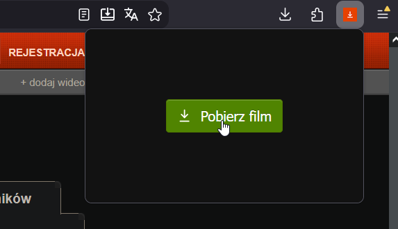
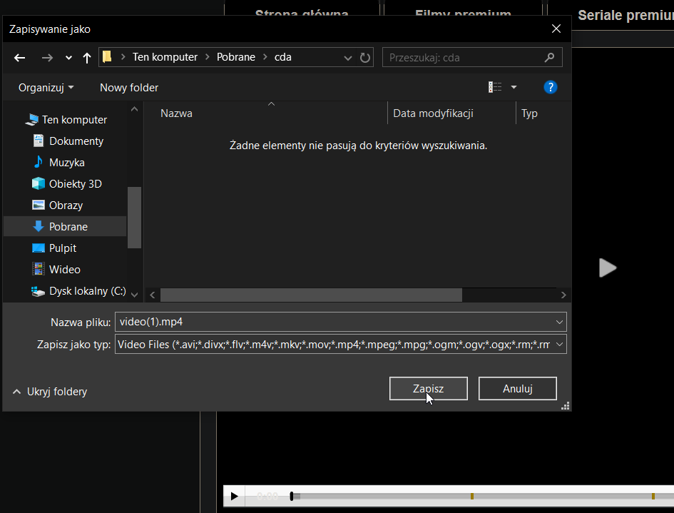
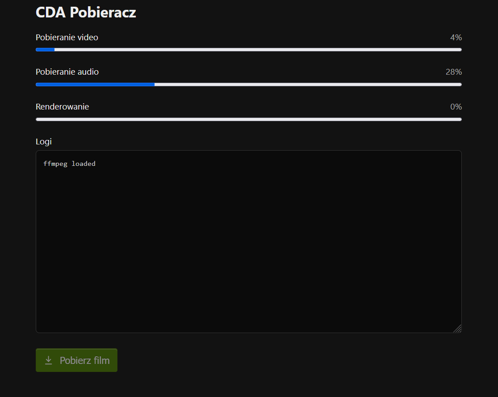

# CDA Pobieracz

Łatwe pobieranie filmów z CDA.pl w postaci dodatku do przeglądarki

Jeśli audio/video są rodzielone, łączy je w przeglądarce za pomocą ffmpeg.wasm (@ffmpeg/ffmpeg)

> RAM is the limit!

https://github.com/auto200/cda-pobieracz/releases

- Otwórz film i kliknij na ikone dodatku
  

- Jeśli CDA udostępnia audio i video w jednym pliku możesz od razu zacząć pobieranie
  

- Jeśli audio i video są rozdzielone, poczekaj aż media zostaną pobranie i połączone  
  

## Development

> Required bun >= 1.3.12

```bash
bun install
```

```bash
# build chrome
bun run build
```

```bash
# build firefox
bun run build:firefox
```

---

Projekt zainspirowany https://github.com/H4wk507/cda-dl
